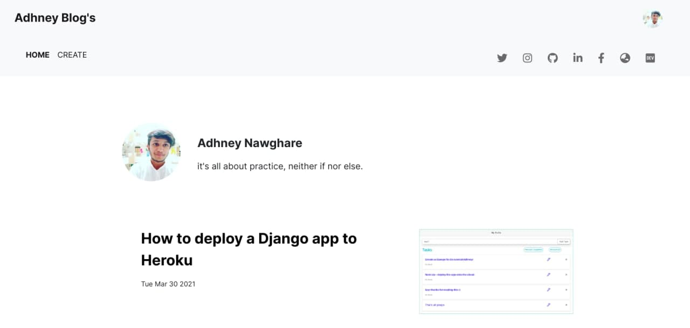

# Blogging site made with MERN!

My Blogging site, all I write end up here. It's build with React for frontend, Express and Node for backend and MongoDb is uses as a Database.
It can even be called the "blogs source" for my adhney.tech website.

Site is live at : https://blogger-undefinedzack.vercel.app/

## Screens

